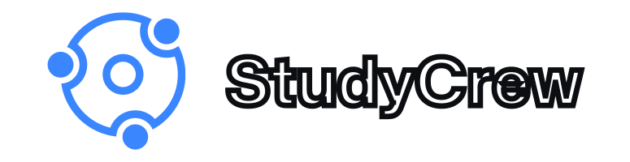

<div align="center">
  
  
</div>

<br />

Welcome to StudyCrew's GitHub repository! This repository serves as the central hub for [www.studycrew.world](https://www.studycrew.world)'s source code, assets, and content.

## Introduction

StudyCrew is a dedicated online platform designed to foster accessible, collaborative, and engaging educational experiences. We're committed to making learning more inclusive and interactive. If you have any questions or inquiries, feel free to reach out to us at [development@studycrew.world](mailto:development@studycrew.world).

## Getting Started

To begin, follow these steps:

1. Clone the repository:

```bash
git clone https://github.com/studycrew/studycrew
```

### Setting up MongoDB

StudyCrew uses MongoDB as its primary data storage. Ensure you have a local instance or a free MongoDB Atlas subscription. Set your connection string in the .env.example file:

```js
MONGODB_URL=[YOUR CONNECTION STRING HERE]
```

### Setting up Authentication with Clerk

For authentication, StudyCrew utilizes Clerk. To set up your local instance, you'll need a Clerk account. Once you've created an account, obtain your credentials and place them in the env.local file:

```js
NEXT_PUBLIC_CLERK_PUBLISHABLE_KEY=[YOUR PUBLISHABLE KEY FROM CLERK]
CLERK_SECRET_KEY=[YOUR SECRET KEY FROM CLERK]
```

### Sentry Exception Handling

If you would like to handle exceptions like we do, just create a free Sentry.io account and replace the `dsn` key with your own in all of the following files:

- `sentry.client.config.ts`
- `sentry.edge.config.ts`
- `sentry.server.config.ts`

Here is an example:

```typescript
import * as Sentry from '@sentry/nextjs'

Sentry.init({
    dsn: '[YOUR DSN HERE]',
    tracesSampleRate: 1,
    debug: false
})
```

### Running the Project Locally

To run the project locally, you need to:

1. `pnpm i` the required dependencies.

2. `pnpm dev` to launch the development server.

## Contributing

Interested in contributing? Check out our contribution guide to learn how you can get involved and contribute to StudyCrew's development.

Before contributing please read the style guidelines from the [Figma documentation](https://www.figma.com/file/BJG9JmbThqdp8p8IWs7gNG/StudyCrew-Prototypes-(Copy)?type=design&node-id=8%3A98&mode=design&t=uwHVDf3Ihi12lro3-1) carefully.

If you have to create a new component, please study existing components so these are kept consistent with the rest of the project.

If you are unsure about anything, just ask! We are more than happy to help and would love to have you are part of the community. 😊

## Developer Hours

Each week, StudyCrew hosts hour-long meetings for contributors and team members to discuss upcoming changes, planned changes, and general strategy. These "developer hours" occur on **Tuesdays and Fridays at 7AM EST (4AM PST) and 4PM EST (1PM PST), respectively**.

## Join Our Community

[Join our Discord community](https://discord.gg/fxd6uHbdBt) for discussions, support, and more!

Thank you for exploring our repository! We're excited to welcome you to our community.
